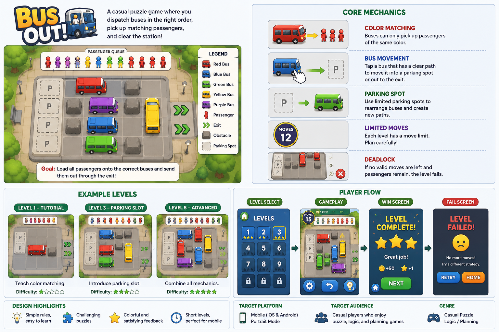

# Bus Out! — Game Design Case Study

## Overview

Bus Out! is a casual mobile puzzle game design case study inspired by bus-route planning and passenger-matching mechanics.

The player manages a crowded bus station where buses are blocked in traffic and passengers are waiting in a strict queue. Each bus has a color and capacity, while passengers can only board buses of the same color. The player must dispatch buses in the correct order, use limited parking spots wisely, and avoid deadlock situations.

This project focuses on game design thinking, including core loop design, game mechanics, level progression, balancing, player experience, and paper-based playtesting.

## Project Goals

- Create a clear Game Design Document.
- Define core mechanics, game rules, win/lose conditions, and player goals.
- Design sample puzzle levels with increasing difficulty.
- Analyze player experience and possible deadlock situations.
- Plan balancing factors such as bus colors, capacities, parking spots, obstacles, and move limits.
- Practice paper-based playtesting and iteration.

## Key Design Areas

- Game Design Document
- Core Loop Design
- Puzzle Mechanics
- Level Design
- Player Experience
- Balancing
- Paper-based Playtesting

## Deliverables

- `docs/BusOut_GDD.md`
- `docs/Level_Design.md`
- `docs/Balancing_Sheet.csv`
- `docs/Playtesting_Notes.md`
- `docs/Sample_Level_Layouts.md`

## Target Platform

Mobile devices: Android and iOS

## Target Audience

Casual mobile players who enjoy short puzzle sessions, colorful visuals, simple rules, and gradually increasing challenges.

## Project Status

In Progress